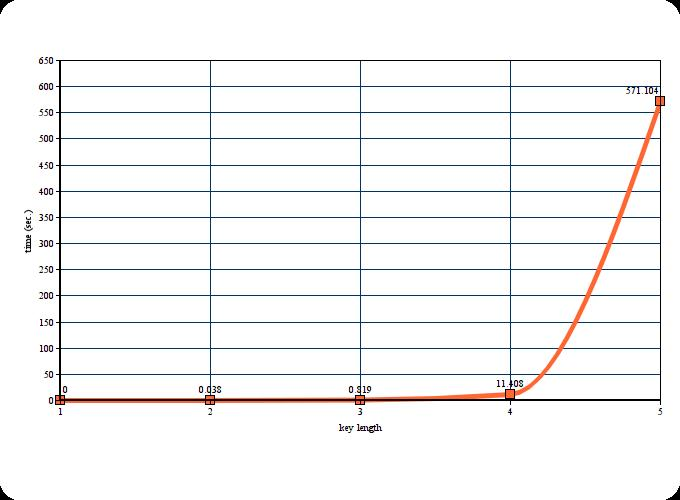

Vigenere bruteforce
====

Measure dependency of key length and time-to-bruteforce it.

## Results

- Data length: 13 letters
- Processor: Intel Core i7 7700

```
iterations: 1000; time 0.000 s., without encoding - 0.000 s.; key length: 1
iterations: 1000; time 0.038 s., without encoding - 0.038 s.; key length: 2
iterations: 1000; time 0.819 s., without encoding - 0.819 s.; key length: 3
iterations: 1000; time 11.408 s., without encoding - 11.407 s.; key length: 4
iterations: 1000; time 571.104 s., without encoding - 571.103 s.; key length: 5
```



## Credits

- https://www.geeksforgeeks.org/print-all-combinations-of-given-length/
- http://www.programming-algorithms.net/article/45623/Vigenere-cipher
- https://cryptii.com/pipes/vigenere-cipher